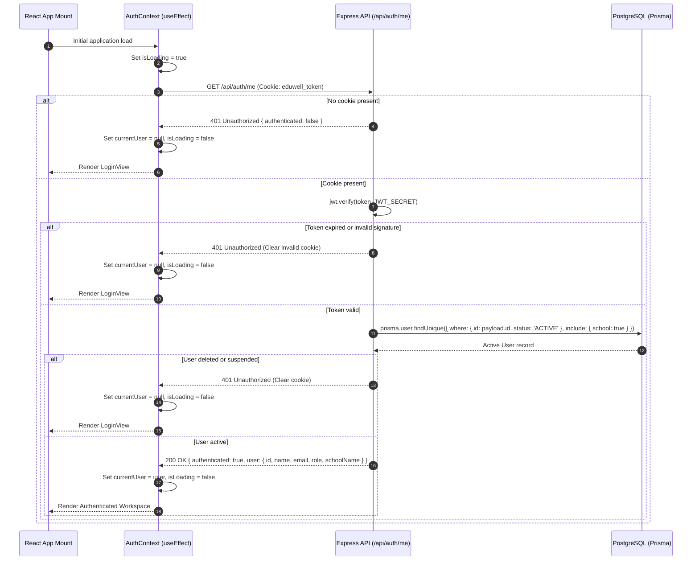
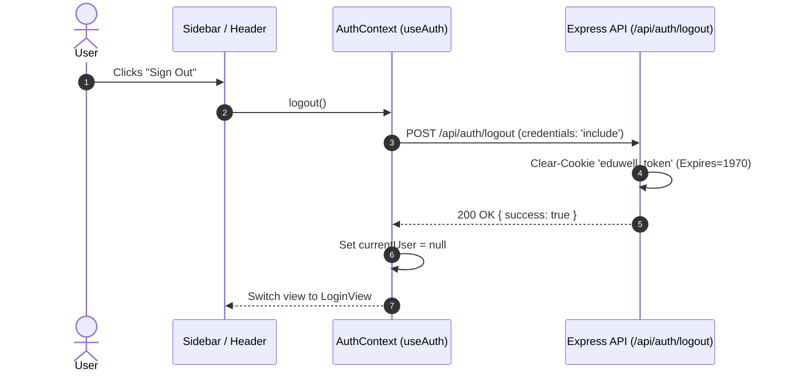

# EduWell Psych — Authentication Flows

This document details the step-by-step authentication flows, sequence diagrams, and error handling paths for the EduWell Psych authentication system.

---

## 1. Password Login Flow (`POST /api/auth/login`)

```mermaid
sequenceDiagram
    autonumber
    actor User as User (Staff/Admin)
    participant UI as React Frontend (LoginView)
    participant Ctx as AuthContext (useAuth)
    participant API as Express API (/api/auth/login)
    participant DB as PostgreSQL (Prisma users/schools)

    User->>UI: Enters email and password
    UI->>Ctx: login(email, password)
    Ctx->>API: POST /api/auth/login { email, password } (credentials: 'include')
    Note over API: Rate Limiter checks IP requests
    API->>API: Validate input format (email regex, password length)
    API->>DB: prisma.user.findFirst({ where: { email, status: 'ACTIVE' }, include: { school: true } })
    DB-->>API: User record (with passwordHash & school)
    
    alt User not found or inactive
        API-->>Ctx: 401 Unauthorized { error: "Invalid email or password." }
        Ctx-->>UI: Display error notification (Sonner)
    else User exists
        API->>API: bcrypt.compare(password, user.passwordHash)
        alt Password mismatch
            API-->>Ctx: 401 Unauthorized { error: "Invalid email or password." }
            Ctx-->>UI: Display error notification (Sonner)
        else Password valid
            API->>API: jwt.sign({ id, schoolId, role, email }, JWT_SECRET, { expiresIn: '7d' })
            API-->>Ctx: 200 OK + Set-Cookie: eduwell_token=JWT; HttpOnly; SameSite=Lax<br/>{ user: { id, name, email, role, schoolName } }
            Ctx->>Ctx: Set currentUser in state
            Ctx-->>UI: Redirect to Role Workspace (Dashboard / Teacher / Parent)
        end
    end
```

---

## 2. Session Hydration Flow (`GET /api/auth/me`)

This flow executes automatically when the user opens or refreshes the application.



---

## 3. Logout Flow (`POST /api/auth/logout`)



---

## 4. Token & Cookie Lifecycle

| Attribute | Setting | Rationale |
| :--- | :--- | :--- |
| **Cookie Name** | `eduwell_token` | Distinct application cookie name |
| **HttpOnly** | `true` | Prevents access from `document.cookie` (XSS mitigation) |
| **SameSite** | `Lax` | Mitigates CSRF while enabling normal navigation |
| **Secure** | `process.env.NODE_ENV === 'production'` | Forces HTTPS transmission in production |
| **Path** | `/` | Accessible to all `/api/*` endpoints |
| **Max-Age** | `7 * 24 * 60 * 60 * 1000` (7 days) | Matches JWT expiration duration |
| **JWT Algorithm** | `HS256` (HMAC-SHA256) | High performance symmetric signing |

---

## 5. Security & Error Handling Matrix

| Scenario | HTTP Code | Response Body | Client Action |
| :--- | :--- | :--- | :--- |
| Missing email / password | `400` | `{"error": "Email and password are required."}` | Highlights form field in red |
| Invalid credentials | `401` | `{"error": "Invalid email or password."}` | Displays toast error message |
| Inactive account (`status != ACTIVE`) | `401` | `{"error": "Invalid email or password."}` | Generic error (no status disclosure) |
| Rate limit exceeded | `429` | `{"error": "Too many login attempts. Please try again later."}` | Blocks submission, notifies user |
| Expired / forged JWT | `401` | `{"error": "Session expired or invalid."}` | Clears session, displays login screen |
| Database connection error | `500` | `{"error": "Authentication service unavailable."}` | Informs user to retry shortly |
